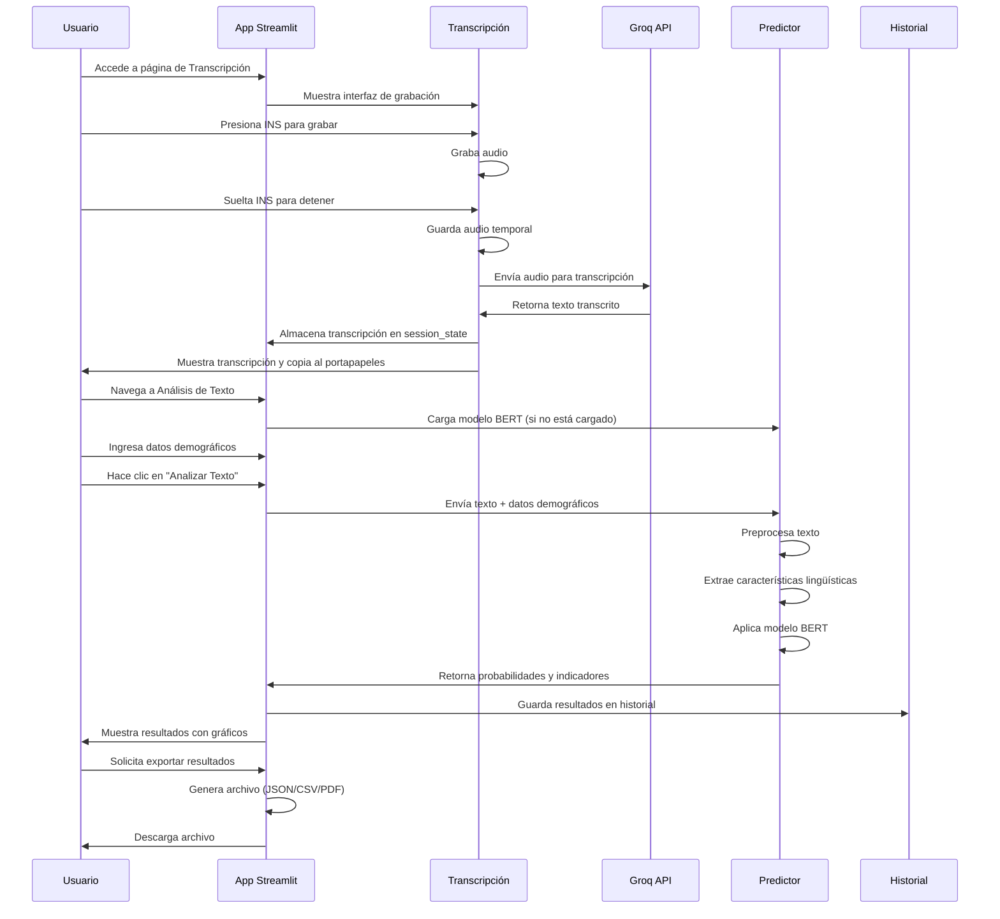
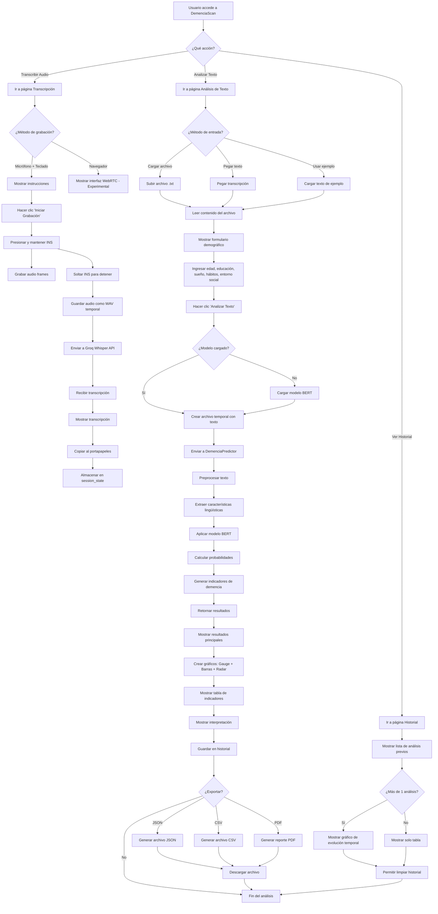

classDiagram
    class DemenciaScanApp {
        +main(): void
        +load_model(): Predictor
        +check_system_status(): dict
        +process_text_analysis(): dict
    }

    class TranscripcionPage {
        +grabar_audio(): tuple
        +guardar_audio(): str
        +transcribir_audio(): str
        +show_recording_interface(): void
    }

    class AnalisisTextoPage {
        +show_input_methods(): void
        +show_demographic_form(): void
        +display_results(): void
        +export_results(): void
    }

    class UtilsGUI {
        +create_probability_gauge(): Figure
        +create_comparison_bars(): Figure
        +create_indicators_radar(): Figure
        +format_prediction_result(): str
        +save_to_history(): void
        +load_history(): list
    }

    class DemenciaPredictor {
        +predict_single_file(): dict
        +preprocess_text(): str
        +extract_features(): dict
    }

    class Config {
        +STREAMLIT_CONFIG: dict
        +MODEL_PATH: Path
        +GROQ_API_KEY: str
        +CLASSIFICATION_THRESHOLDS: dict
        +THEME_COLORS: dict
    }

    class GroqClient {
        +audio.transcriptions.create(): str
    }

    DemenciaScanApp --> TranscripcionPage
    DemenciaScanApp --> AnalisisTextoPage
    DemenciaScanApp --> UtilsGUI
    DemenciaScanApp --> Config
    TranscripcionPage --> GroqClient
    AnalisisTextoPage --> DemenciaPredictor
    AnalisisTextoPage --> UtilsGUI
    UtilsGUI --> Config
    DemenciaPredictor --> Config
```





## 📋 Diagrama UML - Arquitectura de DemenciaScan

### 🏗️ Diagrama de Clases

El diagrama muestra las principales clases y sus relaciones:

1. **DemenciaScanApp**: Clase principal que maneja la aplicación Streamlit
2. **TranscripcionPage**: Maneja la funcionalidad de grabación y transcripción
3. **AnalisisTextoPage**: Gestiona el análisis de texto con el modelo BERT
4. **UtilsGUI**: Utilidades para visualización y manejo de datos
5. **DemenciaPredictor**: Clase que encapsula el modelo BERT y predicciones
6. **Config**: Configuraciones globales de la aplicación
7. **GroqClient**: Cliente para la API de transcripción de Groq

### 🔄 Diagrama de Secuencia

Muestra el flujo de interacción entre usuario, aplicación y servicios externos:

1. **Flujo de Transcripción**: Usuario → Grabación → API Groq → Resultado
2. **Flujo de Análisis**: Usuario → Datos → Modelo BERT → Resultados → Historial

### 📊 Diagrama de Flujo

Detalla el flujo completo de uso de la aplicación:

- **Rutas principales**: Transcripción, Análisis, Historial
- **Procesos internos**: Carga de modelo, preprocesamiento, predicción
- **Salidas**: Visualizaciones, exportaciones, almacenamiento

### 🔗 Relaciones Clave

- **Composición**: `DemenciaScanApp` contiene las páginas y utilidades
- **Dependencia**: Todas las clases dependen de `Config` para configuraciones
- **Uso**: `TranscripcionPage` usa `GroqClient`, `AnalisisTextoPage` usa `DemenciaPredictor`
- **Herencia/Implementación**: No hay herencia directa, pero composición fuerte

Este diagrama proporciona una visión clara de la arquitectura modular y el flujo de datos en la aplicación DemenciaScan.
